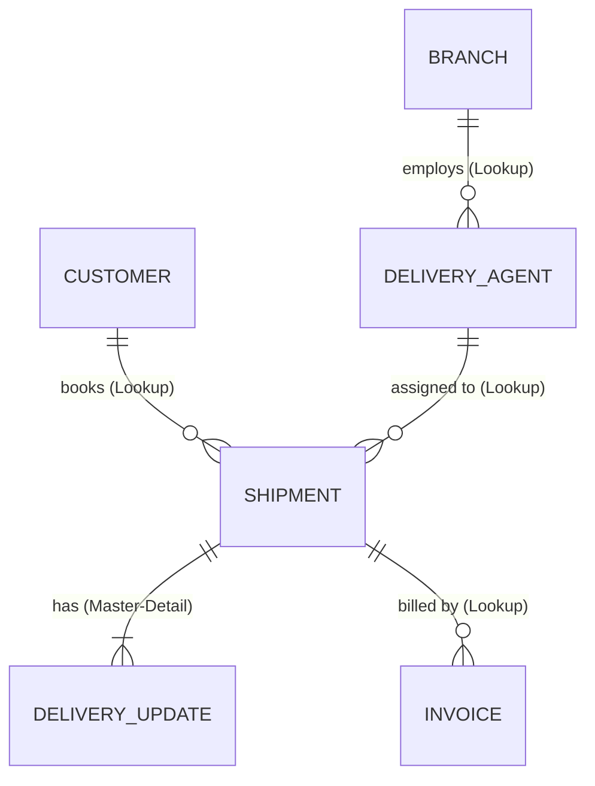

# 📦 Courier Management System (CMS)

A **Salesforce-based cloud application** that centralizes courier operations — shipment booking, real-time tracking, delivery agent assignment, automated status updates, billing, and analytics — across multiple branches.


---

## 📑 Table of Contents

1. [Problem Statement](#-problem-statement)
2. [Project Overview & Purpose](#-project-overview--purpose)
3. [Key Features](#-key-features)
4. [Technology Stack](#-technology-stack)
5. [Solution Architecture](#-solution-architecture)
6. [Data Model](#-data-model)
7. [Validation Rules](#-validation-rules)
8. [Automation (Flow)](#-automation-flow)
9. [Security Model](#-security-model)
10. [Reports & Dashboards](#-reports--dashboards)
11. [Project Planning (Agile)](#-project-planning-agile)
12. [Setup Guide](#-setup-guide)
13. [Testing](#-testing)
14. [Advantages & Limitations](#-advantages--limitations)
15. [Future Scope](#-future-scope)
16. [Conclusion](#-conclusion)

---

## ❗ Problem Statement

Courier and logistics companies often struggle to manage shipments efficiently because of manual processes and disconnected systems:

- No centralized shipment tracking → poor parcel visibility and delayed updates
- Manual delivery agent assignment → scheduling conflicts and delays
- No automated notifications → poor customer communication
- No performance analytics → limited managerial insight
- Multi-branch operations are hard to coordinate

**Result:** customer dissatisfaction, reduced productivity, operational inefficiency, and revenue loss.

| ID | Persona | Wants to | But | Because | Feels |
|----|---------|----------|-----|---------|-------|
| PS-1 | Branch Manager | manage shipments efficiently | tracking is manual | systems are disconnected | stressed |
| PS-2 | Customer | track parcels | updates are delayed | there is no centralized system | uncertain |

---

## 🎯 Project Overview & Purpose

The **Courier Management System (CMS)** replaces manual and fragmented processes with one integrated digital platform built on Salesforce. It enables:

- Efficient shipment booking and real-time tracking
- Delivery agent assignment and automated status updates
- Billing / invoice management
- Performance reporting and dashboards for faster decisions

**Why Salesforce?** Out of the options considered (manual registers, spreadsheets, a standalone portal, Salesforce CRM), Salesforce CRM was selected for its **automation, scalability, and real-time visibility**.

---

## ✨ Key Features

| # | Feature | Description |
|---|---------|-------------|
| FR-1 | Customer management | Store customer contact, address, and type (Regular / Business) |
| FR-2 | Shipment booking | Auto-numbered tracking IDs (`SHP-00000`) with source, destination, weight, price |
| FR-3 | Delivery agent assignment | Link shipments to agents who belong to branches |
| FR-4 | Real-time status updates | Delivery Update records automatically update the Shipment status |
| FR-5 | Invoice generation | Auto-numbered invoices (`INV-0000`) with payment status |
| FR-6 | Reports & dashboards | Shipment status, agent performance, revenue by branch |

**Non-functional requirements:** easy Lightning UI · role-based security · reliable automation · fast tracking updates · 24/7 cloud availability · multi-branch scalability.

**Customer journey:** `Booking → Shipment Creation → Agent Assignment → Transit → Delivery Update → Invoice → Reporting`

---

## 🛠 Technology Stack

| Layer | Technology |
|-------|-----------|
| UI | Salesforce Lightning (Lightning App) |
| Logic / Automation | Salesforce Flows (Record-Triggered), Validation Rules |
| Database | Salesforce Custom Objects |
| Security | Profiles, Roles |
| Reporting | Custom Report Types, Reports & Dashboards |

---

## 🏗 Solution Architecture

```
Customer Input → Shipment Creation → Validation → Agent Assignment
              → Delivery Update → Invoice → Reports & Dashboards
```

**Components:** Customer · Shipment · Delivery Agent · Branch · Delivery Update · Invoice objects, Flows, Reports, Dashboards.

---

## 🗄 Data Model

### Entity Relationship Diagram



### Custom Objects

| Object | API Name | Record Name | Purpose |
|--------|----------|-------------|---------|
| Customer | `Customer__c` | Customer Name (Text) | Customer personal & contact information |
| Shipment | `Shipment__c` | Tracking Number (Auto `SHP-{00000}`) | Parcel details, source, destination, tracking |
| Delivery Agent | `Delivery_Agent__c` | Agent Name (Text) | Agent profiles & branch details |
| Branch | `Branch__c` | Branch Name (Text) | Courier branch offices |
| Delivery Update | `Delivery_Update__c` | Update Number (Auto `UPD-{0000}`) | Status updates for each shipment |
| Invoice | `Invoice__c` | Invoice Number (Auto `INV-{0000}`) | Billing for shipments |

### Relationships

| Child Object | Field | Parent Object | Type |
|--------------|-------|---------------|------|
| Shipment | `Customer__c` | Customer | Lookup |
| Shipment | `Assigned_Agent__c` | Delivery Agent | Lookup |
| Delivery Agent | `Branch__c` | Branch | Lookup |
| Delivery Update | `Shipment__c` | Shipment | Master-Detail |
| Invoice | `Shipment__c` | Shipment | Lookup |

### Fields

<details>
<summary><b>Customer__c</b></summary>

| Field | API Name | Type | Required |
|-------|----------|------|----------|
| Customer Name | `Name` | Text | Yes |
| Email | `Email__c` | Email | Yes |
| Phone | `Phone__c` | Phone | Yes |
| Address | `Address__c` | Text Area | Yes |
| Customer Type | `Customer_Type__c` | Picklist (Regular, Business) | Yes |
| City | `City__c` | Text | No |
| State | `State__c` | Text | No |
| Pincode | `Pincode__c` | Text | No |
| Is Active | `Is_Active__c` | Checkbox | No |
</details>

<details>
<summary><b>Shipment__c</b></summary>

| Field | API Name | Type | Required |
|-------|----------|------|----------|
| Tracking Number | `Name` | Auto Number | Yes |
| Customer | `Customer__c` | Lookup (Customer) | Yes |
| Source Address | `Source_Address__c` | Text Area | Yes |
| Destination Address | `Destination_Address__c` | Text Area | Yes |
| Weight | `Weight__c` | Number | Yes |
| Price | `Price__c` | Currency | Yes |
| Status | `Status__c` | Picklist (Booked, In Transit, Out for Delivery, Delivered, Cancelled) | Yes |
| Expected Date | `Expected_Date__c` | Date | Yes |
| Assigned Agent | `Assigned_Agent__c` | Lookup (Delivery Agent) | No |
| Shipment Type | `Shipment_Type__c` | Picklist (Domestic, International) | Yes |
</details>

<details>
<summary><b>Delivery_Agent__c</b></summary>

| Field | API Name | Type | Required |
|-------|----------|------|----------|
| Agent Name | `Name` | Text | Yes |
| Email | `Email__c` | Email | Yes |
| Phone | `Phone__c` | Phone | Yes |
| Branch | `Branch__c` | Lookup (Branch) | Yes |
| Status | `Status__c` | Picklist (Active, Inactive, On Leave) | Yes |
| Joining Date | `Joining_Date__c` | Date | No |
</details>

<details>
<summary><b>Branch__c</b></summary>

| Field | API Name | Type | Required |
|-------|----------|------|----------|
| Branch Name | `Name` | Text | Yes |
| Branch Code | `Branch_Code__c` | Text | Yes |
| City | `City__c` | Text | Yes |
| State | `State__c` | Text | Yes |
| Manager Name | `Manager_Name__c` | Text | No |
</details>

<details>
<summary><b>Delivery_Update__c</b></summary>

| Field | API Name | Type | Required |
|-------|----------|------|----------|
| Update Number | `Name` | Auto Number | Yes |
| Shipment | `Shipment__c` | Master-Detail (Shipment) | Yes |
| Status | `Status__c` | Picklist (In Transit, Out for Delivery, Delivered, Delayed) | Yes |
| Update Date | `Update_Date__c` | DateTime | Yes |
| Remarks | `Remarks__c` | Text | No |
</details>

<details>
<summary><b>Invoice__c</b></summary>

| Field | API Name | Type | Required |
|-------|----------|------|----------|
| Invoice Number | `Name` | Auto Number | Yes |
| Shipment | `Shipment__c` | Lookup (Shipment) | Yes |
| Amount | `Amount__c` | Currency | Yes |
| Invoice Date | `Invoice_Date__c` | Date | Yes |
| Payment Status | `Payment_Status__c` | Picklist (Paid, Unpaid, Pending) | Yes |
</details>

---

## ✅ Validation Rules

| Object | Rule Name | Error Condition Formula | Error Message |
|--------|-----------|-------------------------|---------------|
| Customer | `Email_Required` | `ISBLANK(Email__c)` | Email is required. |
| Customer | `Validate_Phone_Number` | `LEN(Phone__c) <> 10` | Phone number must be 10 digits. |
| Customer | `Validate_Pincode` | `LEN(Pincode__c) <> 6` | Pincode must be 6 digits. |
| Shipment | `Validate_Weight` | `Weight__c <= 0` | Weight must be greater than zero. |
| Shipment | `Validate_Price` | `Price__c <= 0` | Price must be greater than zero. |
| Shipment | `Validate_Expected_Date` | `Expected_Date__c < TODAY()` | Expected delivery date cannot be in the past. |
| Delivery Agent | `Validate_Agent_Email` | `NOT(CONTAINS(Email__c, "@"))` | Enter a valid email address. |
| Branch | `Branch_Code_Required` | `ISBLANK(Branch_Code__c)` | Branch Code is mandatory. |
| Delivery Update | `Remarks_Required_For_Delay` | `AND(ISPICKVAL(Status__c, "Delayed"), ISBLANK(Remarks__c))` | Remarks are required when status is Delayed. |

---

## ⚙️ Automation (Flow)

**Flow:** `Auto_Update_Shipment_Status` — *Record-Triggered Flow*

| Setting | Value |
|---------|-------|
| Object | `Delivery_Update__c` |
| Trigger | A record is created |
| Condition | None (always run) |
| Optimize for | Actions and Related Records |
| Element | **Update Records** → `Shipment__c` where `Id = {!$Record.Shipment__c}` |
| Field mapping | `Status__c` = `{!$Record.Status__c}` |

**Scenario:** whenever a Delivery Update is logged, the related Shipment's status is updated automatically — no manual intervention.

---

## 🔐 Security Model

### Profiles

| Profile | Base Profile | Purpose |
|---------|--------------|---------|
| Courier Admin | System Administrator | Full system control |
| Branch Manager | Standard Platform User | Manage shipments and agents |
| Delivery Agent | Standard Platform User | Update delivery status |
| Customer Support | Standard User | Handle customers and tracking |

### Object Permissions

| Object | Branch Manager | Delivery Agent | Customer Support |
|--------|----------------|----------------|------------------|
| Customer | Create, Read, Edit | Read | Read, Edit |
| Shipment | Create, Read, Edit | Read, Edit | Read, Edit |
| Delivery Agent | Read, Edit | — | — |
| Branch | Read, Edit | — | — |
| Delivery Update | Create, Read, Edit | Create, Read, Edit | Read |
| Invoice | Read | Read | Read |

Branch Manager & Customer Support: session timeout **2 hours**, minimum password length **8**.

### Role Hierarchy

```
Courier Admin
└── Branch Manager
    ├── Delivery Agent
    └── Customer Support
```

- **Profiles** control *what* a user can do (permissions).
- **Roles** control *which data* a user can see (visibility).

### Sample Users

| User Type | Role | License | Profile |
|-----------|------|---------|---------|
| Courier Admin | Courier Admin | Salesforce | Courier Admin |
| Branch Manager | Branch Manager | Salesforce | Branch Manager |
| Delivery Agent | Delivery Agent | Salesforce Platform | Delivery Agent |
| Customer Support | Customer Support | Salesforce Platform | Customer Support |

---

## 📊 Reports & Dashboards

### Custom Report Types

| Report Type | Primary Object |
|-------------|----------------|
| Shipment Tracking Report | `Shipment__c` |
| Customer Summary Report | `Customer__c` |
| Agent Performance Report | `Delivery_Agent__c` |

### Reports (folder: *CMS Reports*)

| Report | Details |
|--------|---------|
| Shipment Status Summary | Columns: Tracking Number, Customer, Status, Expected Date, Assigned Agent · Grouped by Status · Summary on Price |
| Agent Performance Report | Columns: Agent Name, Branch, Number of Shipments, Status · Grouped by Delivery Agent |
| Revenue by Branch Report | Columns: Tracking Number, Customer, Price, Invoice Status · Grouped by Branch and Month |

### Dashboard — *Courier Management Dashboard*

| Component | Source Report | Chart |
|-----------|---------------|-------|
| Shipment Status Overview | Shipment Status Summary | Donut |
| Agent Performance | Agent Performance Report | Bar |
| Revenue by Branch | Revenue by Branch Report | Column |

Shared with: Courier Admin, Branch Managers, Customer Support team.

---

## 📅 Project Planning (Agile)

Sprint-based execution with Epics → User Stories → Story Points and velocity-based estimation.

| Sprint | Epic | Story | Description | Points | Priority |
|--------|------|-------|-------------|--------|----------|
| 1 | Developer Setup | USN-1 | Create and configure a Salesforce developer account | 3 | High |
| 2 | Data Modeling | USN-2 | Create Customer, Shipment, Delivery Agent, Branch, Invoice objects with relationships | 5 | High |
| 2 | Data Modeling | USN-3 | Create tabs and a Lightning App for all modules | 5 | High |
| 3 | Automation | USN-4 | Validate delivery dates, addresses, mandatory fields | 3 | High |
| 3 | Automation | USN-5 | Automated flows for status updates and agent assignment | 3 | High |
| 4 | Security | USN-6 | Role-based access for managers, agents, staff | 5 | High |
| 5 | Reports | USN-7 | Reports on delivery performance, shipment status, revenue | 4 | High |
| 6 | Dashboards | USN-8 | Dashboards on delivery performance, shipment status, revenue | 4 | Medium |

---

## 🚀 Setup Guide

Everything is configured declaratively in a Salesforce Developer Org (no code required).

1. **Developer account** – sign up at <https://developer.salesforce.com/signup>, verify the email, set a password.
2. **Objects** – Setup → Object Manager → Create Custom Objects (Customer, Shipment, Delivery Agent, Branch, Delivery Update, Invoice). Enable *Allow Reports*, *Track Field History*, *Allow Search*.
3. **Tabs** – Setup → Tabs → create a custom object tab for each of the six objects.
4. **Fields & relationships** – create the fields listed in [Data Model](#-data-model), then the Lookup / Master-Detail relationships.
5. **Validation rules** – add the rules listed in [Validation Rules](#-validation-rules).
6. **Page layouts** – organize fields into sections (e.g. *Customer Information*, *Address Details*, *Shipment Details*, *Delivery Information*).
7. **Flow** – build and activate `Auto_Update_Shipment_Status`.
8. **Lightning App** – App Manager → New Lightning App → *Courier Management System*, add all six object tabs plus Reports and Dashboards.
9. **Profiles → Roles → Users** – create the four profiles, the role hierarchy, and sample users.
10. **Reports & Dashboard** – create report types, reports, and the *Courier Management Dashboard*.

---

## 🧪 Testing

Functional and performance testing was done in the Salesforce org using screenshots to verify:

- Record creation for all objects
- Validation rule enforcement
- Delivery status updates
- Flow automation (Delivery Update → Shipment status)
- Invoice generation
- Dashboard visualization

All scenarios were validated for correct behaviour and reliability.

---

## ⚖️ Advantages & Limitations

**Advantages**
- Centralized data
- Automated workflows
- Real-time reporting

**Limitations**
- Dependency on the Salesforce platform
- Initial configuration effort required

---

## 🔮 Future Scope

- 📱 Mobile tracking app
- 📍 GPS integration
- 💬 SMS notifications
- 🤖 AI-based delivery optimization

---

## 🏁 Conclusion

The Courier Management System successfully digitizes courier operations using Salesforce automation, improving efficiency, accuracy, and customer satisfaction.

---

## 📎 Appendix

- **Source:** Salesforce declarative configuration (no custom code)
- **Dataset:** Salesforce custom objects
- **Demo:** Salesforce Developer Org
